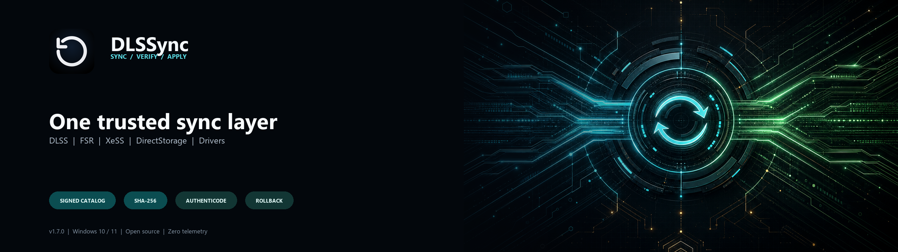

<p align="center">
  <a href="https://github.com/xt0n1-t3ch/DLSSync">
    
  </a>
</p>

# DLSSync: a DLSS, FSR and XeSS updater for Windows

DLSSync is a free, open-source DLSS updater for Windows 10/11 x64. It also works as an FSR updater and XeSS updater for supported DLLs already present in game folders, manages Streamline and DirectStorage sets, and includes a GPU driver updater for NVIDIA, AMD and Intel. Local SHA-256-verified backups and an operation journal help you inspect changes and restore retained DLL snapshots.

**Release status:** version 1.7.0 is released for Windows 10/11 x64 as Standard and NexusBuild packages from one source commit. See the [1.7.0 changelog](CHANGELOG.md#170---unreleased) and read the signature statement in the release notes before running an installer.

<p align="center">
  <a href="https://github.com/xt0n1-t3ch/DLSSync/releases/latest"></a>
  <a href="https://github.com/xt0n1-t3ch/DLSSync/actions/workflows/ci.yml"></a>
  <a href="LICENSE"></a>
  <a href="https://github.com/xt0n1-t3ch/DLSSync/stargazers"></a>
  <a href="https://www.nexusmods.com/site/mods/1922"></a>
  <a href="https://xt0n1.com"></a>
</p>

<p align="center">
  
  
  
  
  
  
</p>

[Install](#download) · [Update a game](#update-a-game-in-one-click) · [Restore](#restore-a-backup) · [Drivers](#use-the-gpu-driver-updater) · [Fix errors](#fix-common-errors) · [Privacy](#privacy-and-network-behavior) · [All guides](docs/index.md)

<h2 id="download">Choose and install a build</h2>

Download Standard from [GitHub Releases](https://github.com/xt0n1-t3ch/DLSSync/releases/latest), or choose the Nexus channel from [Nexus Mods, mod 1922](https://www.nexusmods.com/site/mods/1922). Check the channel as well as the version before installing.

<p align="center">
  <a href="https://github.com/xt0n1-t3ch/DLSSync/releases/latest">
    
  </a>
</p>

| Channel policy | Standard | Nexus (`NexusBuild-` assets) |
|---|---|---|
| App self-updater | Included for installed mode | Absent; install app updates manually |
| Automatic catalog refresh | Allowed | Disabled |
| Catalog refresh button | Available | Explicit manual refresh only |
| Other network actions | See the network section below | Must be explicit and manual |
| v1.7.0 release rule | One `v1.7.0` tag | Same tag and source commit; distinct `NexusBuild-` names |

These are the v1.7.0 channel requirements, not a certification of published packages. The current checkout still needs packaged network and artifact verification described in [Nexus build rules and verification](docs/nexus-build.md). Do not assume an arbitrary development build satisfies the full manual-only network rule.

Choose an available Windows x64 format:

- **NSIS `*-setup.exe`:** current-user installation, configured for `%LOCALAPPDATA%\DLSSync\`. This is the normal Standard self-update route.
- **MSI `*.msi`:** Windows Installer package for MSI-based deployment. Check your deployment permissions; the app updater is not an MSI deployment mechanism.
- **Portable `*-portable.zip`:** extract the whole archive to a writable folder. Keep `portable.flag` beside the executable. State lives in its `data` folder and in-app app updates are disabled. Nexus portable mode retains the stricter Nexus network policy.

The desktop UI uses Microsoft WebView2. Installation, driver work and writes to protected game folders can have different permission requirements. If Windows warns about the download, stop and verify the source and the exact file; do not disable Windows protection to make it run. Windows code signing is optional in the release workflow, so this repository does not establish that a downloaded installer is signed. See [download verification and Windows warnings](docs/signing-reality.md).

## Update a game in one click

Close the game before changing its DLLs. Updating an existing integration does not add DLSS, FSR, XeSS or frame generation to a game that lacks it.

1. Open **Library** and scan. Discovery supports Steam, Epic Games, GOG Galaxy, Ubisoft Connect, EA Desktop, Xbox/Microsoft Store and Battle.net. It is not exhaustive.
2. If a game is missing, add its install folder through Settings and scan again. Use the actual game directory, not a drive root or Windows folder.
3. Open the game details to inspect detected components, versions and warnings. Check the game's policy before changing files in a protected or online game. An absent warning does not prove safety.
4. Choose the game's update action to start a one-click update using the selected components. The app prepares and validates the operation; routine updates do not need a separate confirmation. Integrity, compatibility, running-game or stale-file checks can still stop it.
5. Read the per-file result, then launch and test the game. A completed file operation does not prove the game works correctly.

Use **Refresh Catalog** when you explicitly want newer catalog information, particularly on Nexus. Version pins and feature switches affect which candidates are offered. [Versions and compatibility](docs/versions-and-compatibility.md) explains why a component can have no update target even when a newer-looking number exists.

The [DLSS/FSR/XeSS family map](docs/dll-families.md) identifies DLLs by role. [Streamline sets](docs/streamline.md) explains why related `sl.*.dll` members move together. DirectStorage's `dstorage.dll` and `dstoragecore.dll` also belong to a matched package; do not substitute one unrelated DLL manually.

## Restore a backup

Close the game, open **Backups**, locate the snapshot for the affected game and choose **Restore**. This is a one-click restore action for a retained snapshot, not an unconditional recovery guarantee.

DLL restoration uses local snapshot files and validates their SHA-256. Missing or damaged snapshots, file locks, invalid paths, permissions and disk errors can prevent restoration. Inspect the operation result and journal before retrying. Do not delete backup data while investigating a failed rollback. See [restore a backup](docs/restoring-backups.md), including separate limits for driver recovery.

## Use the GPU driver updater

Open **Drivers**, check the detected GPU and installed version, and review the available package and release notes. Start the install action when a verified direct package is available. The AMD source does not synthesize an installer URL. It uses an observed official AMD page, so the AMD action opens that page for package selection.

The app downloads the selected GPU installer, verifies its Authenticode publisher and launches it. Windows may request administrator approval. Follow any vendor UI and reboot request, then recheck the active driver version: a successful installer exit is not proof that Windows loaded the intended version.

Windows device-driver updates use Windows Update Agent through a separate system-driver path. That path can attempt a driver export and System Restore checkpoint when snapshot inputs are supplied; neither is guaranteed to succeed. Do not treat GPU or Windows driver installation as universally reversible. Read the [GPU and Windows driver guide](docs/drivers.md).

## Understand versions, presets and optional mods

A catalog package version and a DLL's internal file version can differ. **Unknown**, experimental, ahead-of-catalog and incompatible states are not interchangeable. A correct hash proves a match to expected bytes, not game or hardware compatibility. Read [versions and compatibility](docs/versions-and-compatibility.md) before forcing a historical or experimental candidate.

NVIDIA profile overrides are separate from copying DLLs. Use [DLSS presets and frame-generation overrides](docs/dlss-overrides.md) for per-game versus global scope, reset behavior and capability limits. [Optional mods](docs/optional-mods.md) explains why detecting DLSS Enabler or OptiScaler is not a promise that arbitrary mod combinations work.

## Fix common errors

| Problem | First action |
|---|---|
| Game missing or no supported DLLs | Check the install folder and rescan; discovery does not add absent integrations. |
| Game running or DLL locked | Close the game normally, wait for it to exit, then retry. |
| Hash or publisher mismatch | Stop. Refresh the catalog explicitly and inspect the source; do not bypass verification. |
| Permission or backup failure | Check write access and free space; preserve backups and the journal. |
| Missing asset or incompatible architecture | Do not substitute a similarly named DLL. Record the family, version and error. |
| Rollback failed | Open Backups and inspect recovery evidence before another update. |

Use the [error-message reference](docs/error-messages.md) for exact classes and [diagnostics guide](docs/troubleshooting.md) for logs. Review and redact diagnostics **before** opening a prefilled GitHub issue URL: its encoded contents are sent to GitHub when the browser opens it, before you submit an issue.

## Verification layers

These checks answer different questions:

- **Catalog signature:** Ed25519 verifies the signed metadata. The [catalog repository](https://github.com/xt0n1-t3ch/DLSSync-Manifest) is separate from the app.
- **Artifact digest:** the catalog records the expected algorithm and hash. Historical entries can use MD5; other entries use SHA-256. Do not relabel an MD5 check as SHA-256.
- **Publisher verification:** Authenticode checks publisher identity and Windows trust separately from the digest. Publisher subject allowlisting is not certificate pinning. Do not use advanced unsigned-file settings as a routine error fix.
- **Backup integrity:** SHA-256 verifies retained snapshot bytes for restore.
- **Standard app-update signature:** Tauri verifies its signed update payload. This is not the same as Windows Authenticode signing of the installer.

Catalog sources include first-party releases and labeled DLSS Swapper community-archive history. An original vendor signature does not make an archive a first-party distribution source. None of these checks proves that a particular game, GPU or mod combination works.

## Privacy and network behavior

The repository has no telemetry endpoint. Functional network requests still disclose information to their destinations, and enabled features can contact more than one host:

- **App and catalog checks:** Standard allows automatic checks; Nexus disables app self-update and automatic catalog refresh. Catalog requests retrieve the manifest and detached signature through the configured CDN.
- **DLL downloads:** the exact source URL recorded for the selected artifact can point to vendor GitHub/NuGet assets or community history.
- **Artwork:** Steam artwork and optional SteamGridDB lookup can fetch images. SteamGridDB searches send an individual game title and use bearer authentication with the configured API key.
- **GPU checks and downloads:** vendor services receive compatibility parameters used to resolve a package. The current Drivers, Catalog and Settings code can initiate driver checks; this is not limited to clicking Install or opening Drivers. See the unresolved Nexus scope in [the channel guide](docs/nexus-build.md).
- **Windows drivers:** Windows Update Agent uses Windows update services for applicable device-driver operations.
- **Public links and diagnostics:** opening release notes, source, support or a prefilled issue contacts the destination in your browser. Standard's community star-count lookup can also contact GitHub; Nexus disables that lookup.

The app does not batch-upload the game library. This does not mean all requests are unauthenticated or contain no device/game information. No channel-specific packet capture was performed for this documentation review.

## Where your data lives

| Mode | Data root |
|---|---|
| Installed, Standard or Nexus | `%USERPROFILE%\DLSSync\` |
| Portable, with `portable.flag` beside the executable | `data\` beside that executable |

Within that root, `Backups\` contains snapshot files and `backups.db`; `Settings\settings.json` stores preferences; `Logs\` holds logs; and `Cache\` includes catalog data, `notifications.db` and the durable `operations.db` journal. Despite its directory name, do not delete the entire Cache folder as a generic troubleshooting step: it contains operation history. Use the app's folder-opening actions to find the active paths.

## Build from source and contribute

The stack is Tauri v2, Svelte and Rust. Use the Node and pnpm versions declared in [package.json](package.json), the Rust toolchain in [rust-toolchain.toml](rust-toolchain.toml), and Windows native build prerequisites described in [CONTRIBUTING.md](CONTRIBUTING.md). From a prepared checkout:

```powershell
pnpm install
pnpm dev
```

`pnpm build` packages the Standard app. See [repository instructions and validation gates](AGENTS.md), [architecture](docs/architecture-1.7.md) and the [test index](tests/index.md). Current installer size, startup time, RAM and CPU measurements are not verified; no footprint numbers are promised here. Windows 10/11 x64 is the supported platform; no Linux release date is promised.

For alternatives, use the [dated comparison matrix](docs/competitive-comparison.md). Unverified competitor capabilities are labeled as such; DLSSync does not claim to be another project's successor.

<h2 id="author">Author and support</h2>

[GitHub](https://github.com/xt0n1-t3ch) · [Discord](https://discord.com/users/211189703641268224) · [Author website](https://xt0n1.com) · [Report an issue](https://github.com/xt0n1-t3ch/DLSSync/issues)

<h2 id="sponsor">Sponsor</h2>

You can support maintenance through the existing sponsorship links.

<p>
  <a href="https://ko-fi.com/xt0n1"></a>
  <a href="https://github.com/sponsors/xt0n1-t3ch"></a>
  <a href="https://www.paypal.me/xt0n1"></a>
</p>

<h2 id="license">License and attribution</h2>

DLSSync uses Apache 2.0; see [LICENSE](LICENSE) and [NOTICE](NOTICE). It is an independent project, not endorsed by, sponsored by or affiliated with NVIDIA, Intel, AMD or Microsoft. Their product names and trademarks belong to their respective owners. See the [documentation index](docs/index.md) for user and contributor references.
